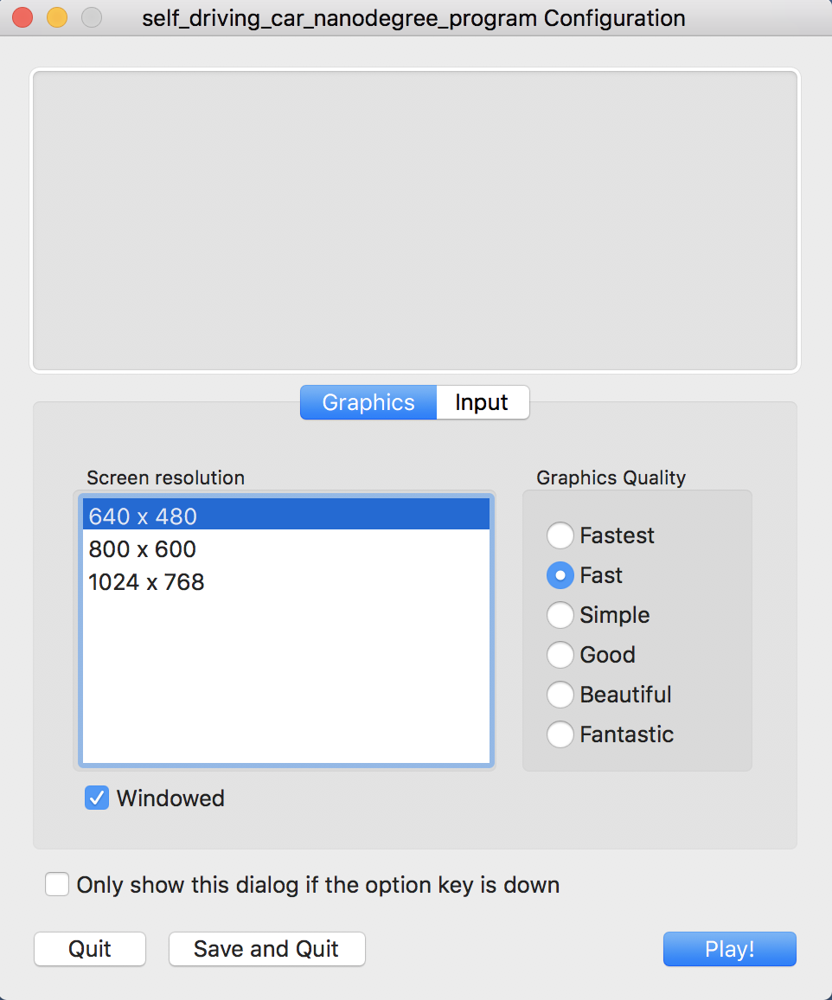
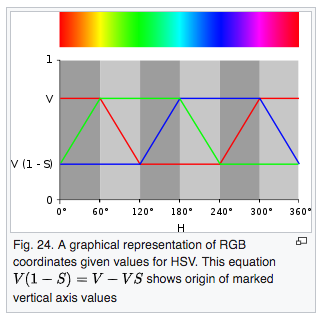
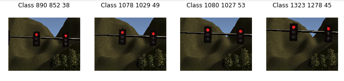
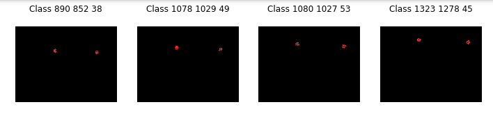
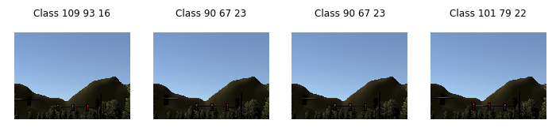
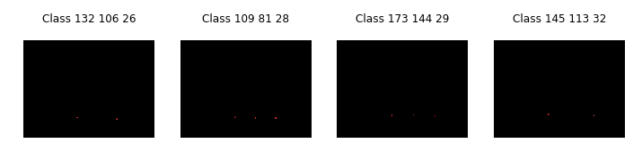

This is the project repo for the final project of the Udacity Self-Driving Car Nanodegree: Programming a Real Self-Driving Car. 

I have developed the system with the native installation. **One** of the two installation options, either native **or** docker installation.

You can look for more info on the original link https://github.com/udacity/CarND-Capstone

### Native Installation

* Be sure that your workstation is running Ubuntu 16.04 Xenial Xerus or Ubuntu 14.04 Trusty Tahir. [Ubuntu downloads can be found here](https://www.ubuntu.com/download/desktop).
* If using a Virtual Machine to install Ubuntu, use the following configuration as minimum:
  * 2 CPU
  * 2 GB system memory
  * 25 GB of free hard drive space

  The Udacity provided virtual machine has ROS and Dataspeed DBW already installed, so you can skip the next two steps if you are using this.

* Follow these instructions to install ROS
  * [ROS Kinetic](http://wiki.ros.org/kinetic/Installation/Ubuntu) if you have Ubuntu 16.04.
  * [ROS Indigo](http://wiki.ros.org/indigo/Installation/Ubuntu) if you have Ubuntu 14.04.
* [Dataspeed DBW](https://bitbucket.org/DataspeedInc/dbw_mkz_ros)
  * Use this option to install the SDK on a workstation that already has ROS installed: [One Line SDK Install (binary)](https://bitbucket.org/DataspeedInc/dbw_mkz_ros/src/81e63fcc335d7b64139d7482017d6a97b405e250/ROS_SETUP.md?fileviewer=file-view-default)
* Download the [Udacity Simulator](https://github.com/udacity/CarND-Capstone/releases).


### Port Forwarding
To set up port forwarding, please refer to the [instructions from term 2](https://classroom.udacity.com/nanodegrees/nd013/parts/40f38239-66b6-46ec-ae68-03afd8a601c8/modules/0949fca6-b379-42af-a919-ee50aa304e6a/lessons/f758c44c-5e40-4e01-93b5-1a82aa4e044f/concepts/16cf4a78-4fc7-49e1-8621-3450ca938b77)

### Usage

1. Clone the project repository
```bash
git clone https://github.com/udacity/CarND-Capstone.git
```

2. Install python dependencies
```bash
cd CarND-Capstone
pip install -r requirements.txt
```
3. Make and run styx
```bash
cd ros
catkin_make
source devel/setup.sh
roslaunch launch/styx.launch
```
4. Run the simulator

These are my settings for the simulator. If I use another resolution I have problems with performance on PID.



# System Architecture
The following is a system architecture diagram showing the ROS nodes and topics used in the project.


## Waypoint Updater
I have follow the guideline on <a href="https://classroom.udacity.com/nanodegrees/nd013/parts/6047fe34-d93c-4f50-8336-b70ef10cb4b2/modules/e1a23b06-329a-4684-a717-ad476f0d8dff/lessons/462c933d-9f24-42d3-8bdc-a08a5fc866e4/concepts/e1f2a5cf-c697-4880-afb2-b88f3f83d07b">Waypoint Updater Node Overview</a>  and Waypoint <a href="https://classroom.udacity.com/nanodegrees/nd013/parts/6047fe34-d93c-4f50-8336-b70ef10cb4b2/modules/e1a23b06-329a-4684-a717-ad476f0d8dff/lessons/462c933d-9f24-42d3-8bdc-a08a5fc866e4/concepts/afb9f3b2-58d7-4ec6-88f3-fc4f84d9a8a1">Updater Node Revisited</a> 

The eventual purpose of this node is to publish a fixed number of waypoints ahead of the vehicle with the correct target velocities, depending on traffic lights and obstacles. The goal for the first version of the node should be simply to subscribe to the topics

/base_waypoints
/current_pose

and publish a list of waypoints to

/final_waypoints

After that the traffic light detection has to be developed. At the beggining, info from the simulator can be used, but after that, image recognition must be used.

Once traffic light detection is working properly, you can incorporate the traffic light data into your waypoint updater node. To do this, you will need to add a subscriber for the /traffic_waypoint topic and implement the traffic_cb callback for this subscriber.


## Traffic Light Detection
I have tried some classification with Neural Networks, but when I tried to run the simulator on them, then everything begin to slow down and the car goes off road.

I have developed this on my computer so I have to look for a quickest way to detect the red light.

Since we know the locations of the traffic lights and the car pose, it is posible to reduce the number of times you look for traffic light.
When its needed to look for it, its quick enough to make a color search.
The most important color is red, wich has two separated ranges in HSV space.


https://en.wikipedia.org/wiki/HSL_and_HSV#HSV_to_RGB

Once the ranges are defined, a mask can be calculated, obtaining the following results:



Where the numbers are the total of binary points in the mask, and the points for lower and upper ranges.

Even when the traffic light is far enough, the red light can be detected.




A notebook is included, with some test performed on images captured from the simulator.


## Final lap

After that, the autonomous driving is achieved with good perfomance on the development computer.

 <a href="http://www.youtube.com/watch?feature=player_embedded&v=oahyKMsqtmY
" target="_blank"></a>

 
 Quicktime recording of the desktop introduces charge on the CPU so more difficult for the computer to have the virtual machine, simulator and quicktime running at the same time whitout affect the car trajectory.


